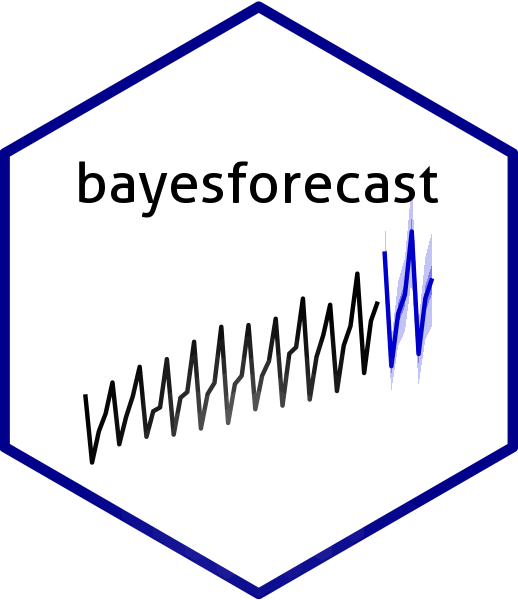
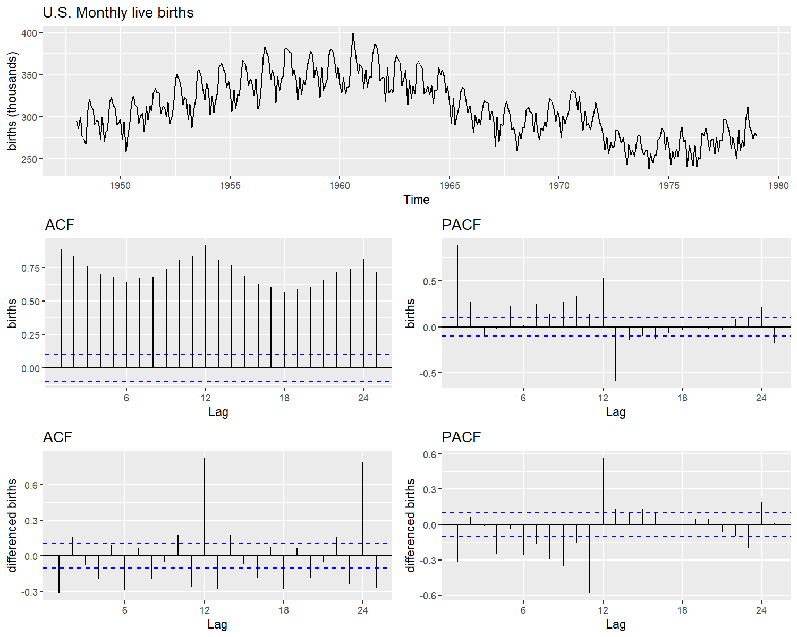
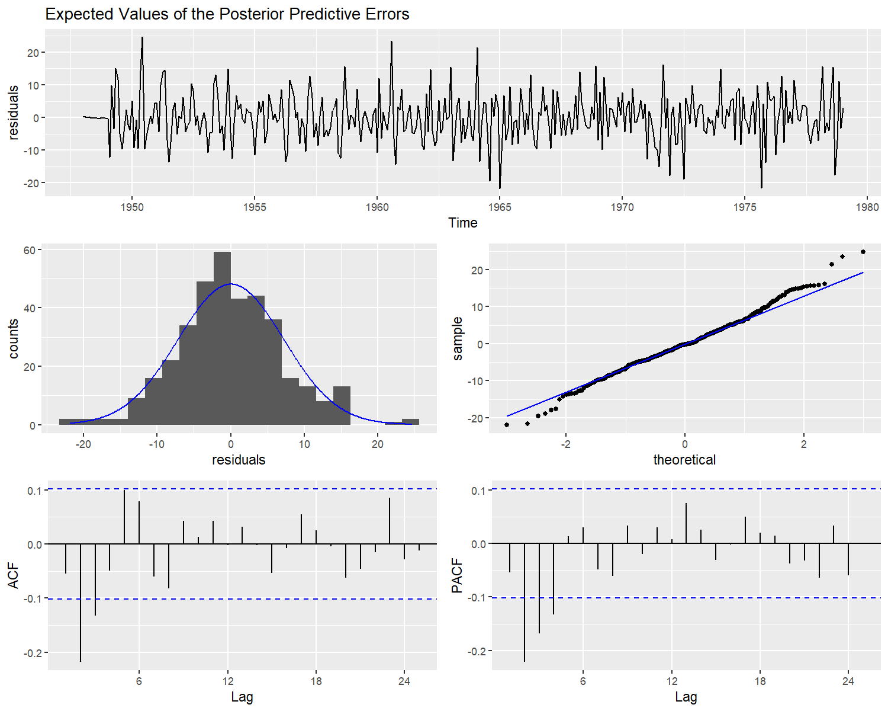
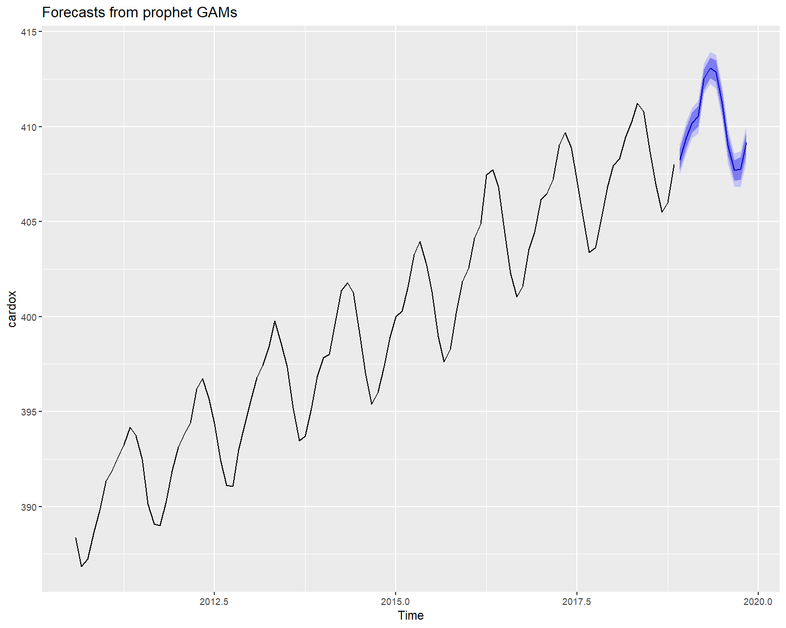

[](https://mc-stan.org)

# Automatic forecasting and Bayesian modeling for time series

The *bayesforecast* package implements Bayesian estimation of structured
time series models, using the Hamiltonian Monte Carlo method,
implemented with [Stan](https://mc-stan.org/), a probabilistic language
model in C++. The aim of this package is to provide an interface for
forecasting and Bayesian modelling of the most popular time series
models.

On the beta version 1.0.0, the available models are:

-   ARIMA [Box and
    Jenkins (1970)](https://www.wiley.com/en-us/Time+Series+Analysis%3A+Forecasting+and+Control%2C+5th+Edition-p-9781118675021).
-   Multiplicative Seasonal ARIMA [Brockwell and
    Davis (2016)](https://www.amazon.com/dp/3319298526/ref=cm_sw_su_dp?tag=otexts-20)
-   GARCH
    [Bollerslev (1986)](https://doi.org/10.1016/0304-4076(86)90063-1)
-   Asymmetric GARCH [Fonseca et.
    al (2019)](https://arxiv.org/abs/1910.01398)
-   ARMAX
    [Pankratz (1991)](https://www.amazon.com/dp/0471615285/ref=cm_sw_su_dp?tag=otexts-20)
-   Dynamic Harmonic regression
    [Pankratz (1991)](https://www.amazon.com/dp/0471615285/ref=cm_sw_su_dp?tag=otexts-20)
-   Stochastic Volatility models [Sangjoon et.
    al. (1998)](https://www.jstor.org/stable/2566931)
-   Local global trend [Ng et.
    al. (2020)](https://arxiv.org/abs/2004.08492)
-   Additive ETS models from the [forecast
    package](https://github.com/robjhyndman/forecast). [Rob and
    Khandakar (2008)](https://www.jstatsoft.org/article/view/v027i03)
    -   Local level models
    -   Holt’s linear trend
    -   Holt-Winter’s

Additionally the forecast function is implemented for automatic
forecast, by default a Generalized additive model from the
[prophet](https://facebook.github.io/prophet/docs/installation.html#r)
package is used.

### Installation

This is still a beta version package, so currently installing it could
be challenging, we recommend to install the current R version (**R4.0**)
and the **Rtools4.0**. After that, install the package
[rstan](https://mc-stan.org/users/interfaces/rstan.html), you can follow
the installation procedure
[here](https://github.com/stan-dev/rstan/wiki/RStan-Getting-Started).

To install the latest release version from CRAN use

``` r
install.packages("bayesforecast")
```

The current developmental version can be downloaded from github via:

``` r
if (!requireNamespace("remotes")) install.packages("remotes")

remotes::install_github("asael697/bayesforecast",dependencies = TRUE)
```

### Case study: Analyzing the monthly live birth in U.S. an example

As an example, we provide a time series modelling for the monthly live
births in the United States 1948-1979, published by [Stoffer
(2019)](https://github.com/nickpoison/astsa). In **figure 1** , the data
has a seasonal behaviour that repeats every year. The series *waves* in
the whole 40 years period (*superior part*). In addition, the partial
(*pacf*) and auto-correlation (*acf*) functions are far from zero
(*middle part*). After applying a difference to the data, the ACF and
PACF plots still have some non-zero values every 12 lags (*inferior
part*).

<div class="figure" style="text-align: center">


<p class="caption">
Monthly live birth U.S.A
</p>

</div>

For start, a multiplicative Seasonal ARIMA model could give a good fit
to the data, following [Tsay
(2010)](https://www.amazon.com/dp/047136164X/ref=cm_sw_su_dp?tag=otexts-20)
recommendations for order selection using the auto-correlation
functions, we define (p = 1, d = 1, q = 1) and for the seasonal part (P=
1, D = 1 and Q = 1). The fitted model is defined as follows

``` r
sf1 = stan_sarima(ts = birth,order = c(1,1,1),seasonal = c(1,1,1),
                  prior_mu0 = student(mu = 0,sd = 1,df = 7))
```

All fitted models are *varstan* objects, these are S3 classes with the
*stanfit* results provided by the
[rstan](https://mc-stan.org/users/interfaces/rstan.html) package, and
other useful elements that make the modeling process easier.

``` r
sf1
#> 
#> y ~ Sarima(1,1,1)(1,1,1)[12] 
#> 373 observations and 1 dimension 
#> Differences: 1 seasonal Differences: 1 
#> Current observations: 360 
#>  
#>              mean     se         5%        95%      ess   Rhat
#> mu0        0.0017 0.0019    -0.1973     0.2014 3358.708 0.9998
#> sigma0     7.3412 0.0043     6.9097     7.8165 3951.632 0.9998
#> ar        -0.2522 0.0013    -0.3717    -0.1176 3985.357 1.0004
#> ma        -0.0336 0.0014    -0.1853     0.0818 3928.152 1.0009
#> sar        0.0086 0.0014    -0.1515     0.1425 3982.520 1.0008
#> sma       -0.6750 0.0015    -0.7887    -0.4982 3869.922 1.0004
#> loglik -1231.6717 0.0307 -1235.4485 -1229.2336 3867.011 1.0021
#> 
#>  Samples were drawn using sampling(NUTS). For each parameter, ess
#>  is the effective sample size, and Rhat is the potential
#>  scale reduction factor on split chains (at convergence, Rhat = 1).
```

After fitting our model we can make a visual diagnostic of our
parameters, check residuals and fitted values using the plot method. The
package provides the posterior sample of every residual, but checking
all of them is an exhausting task. An alternative, is checking the
process generated by the residuals posterior estimate.

``` r
check_residuals(sf1)
```



A white noise behavior indicates a good model fit. The model’s residuals
in figure 2, seems to follow a random noise, the auto-correlation in
*acf plots* quickly falls to zero, indicating an acceptable model fit.
Finally a forecast of the for the next year can be performed as:

``` r
autoplot(forecast(object = sf1,h = 12))
```


### Automatic forecast with prophet

Automatic prediction is possible using the **forecast** function, by
default the prediction is done using Generalized additive models from
the
[prophet](https://facebook.github.io/prophet/docs/quick_start.html#python-api)
package.

``` r
library(astsa)
autoplot(object = forecast(cardox,h = 12),include = 100)
```



### References

For further readings and references you can check:

-   Stan Development Team. 2018. Stan Modeling Language Users Guide and
    Reference Manual, Version 2.18.0.
    [http://mc-stan.org](https://mc-stan.org)

-   Forecasting: Principles and practice Monash University, Australia.
    [Forecasting principles](https://otexts.com/fpp2/)

-   Time Series Analysis and Its Applications, With R Examples — 4th
    Edition.[astsa](https://www.stat.pitt.edu/stoffer/tsa4/index.html)

-   facebook/prophet Quick start documentation.
    [prophet](https://facebook.github.io/prophet/docs/quick_start.html#python-api)

-   Orbit API Documentation and Examples.
    [Orbit](https://uber.github.io/orbit/)
